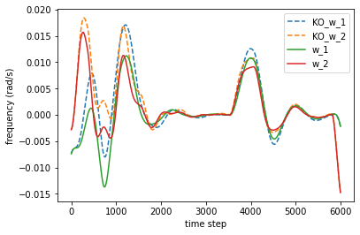
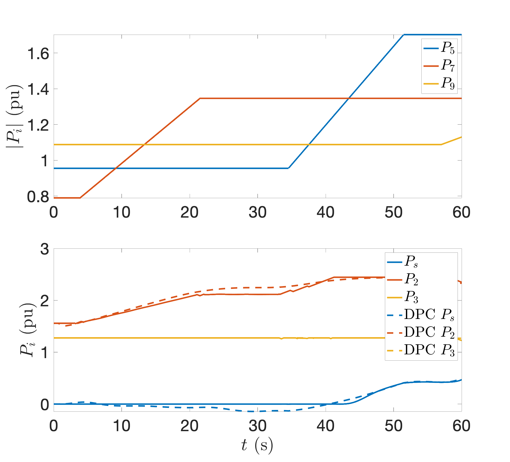

# NeuroMANCER
## Neural Modules with Adaptive Nonlinear Constraints and 	Efficient Regularizations

## [Complete Documentation](https://pnnl.github.io/neuromancer/)


## Setup

##### Clone and install neuromancer, linear maps, and emulator packages
```console
user@machine:~$ mkdir ecosystem; cd ecosystem
user@machine:~$ git clone https://github.com/pnnl/neuromancer.git
user@machine:~$ git clone https://github.com/pnnl/psl.git
user@machine:~$ git clone https://github.com/pnnl/slim.git

# Resulting file structure:
    ecosystem/
        neuromancer/
        psl/
        slim/
```

##### Create the environment via .yml (Linux)

```console
user@machine:~$ conda env create -f env.yml
(neuromancer) user@machine:~$ source activate neuromancer
```

##### If .yml env creation fails create the environment manually

```console
user@machine:~$ conda config --add channels conda-forge pytorch
user@machine:~$ conda create -n neuromancer python=3.7
user@machine:~$ source activate neuromancer
(neuromancer) user@machine:~$ conda install pytorch torchvision -c pytorch
(neuromancer) user@machine:~$ conda install scipy pandas matplotlib control pyts numba scikit-learn mlflow dill
(neuromancer) user@machine:~$ conda install gym -c conda-forge
```

##### install neuromancer ecosystem 

```console
(neuromancer) user@machine:~$ cd psl
(neuromancer) user@machine:~$ python setup.py develop
(neuromancer) user@machine:~$ cd ../slim
(neuromancer) user@machine:~$ python setup.py develop
(neuromancer) user@machine:~$ cd ../neuromancer
(neuromancer) user@machine:~$ python setup.py develop
```

##### install packages necessary for DED-DPC example 

```console
(neuromancer) user@machine:~$ conda install pyomo pyutilib cyipopt -c conda-forge
```


###  Solving Dynamics Aware Economic Dispatch 
Constructing a surrogate model of generator swing dynamics with a Koopman operator (KO) approach and leveraging differentiable predictive control to learn a solution map from forecast system loads to a schedule of 
generation inputs that meets the loads at least cost.

Implementation of the methods and results presented in the American Control Conference proceeding (accepted): [Koopman-based Differentiable Predictive Control for the
Dynamics-Aware Economic Dispatch Problem](link).


*Conceptual methodology.*

#### Paper results

We use a KO surrogate model to reduce the computational cost of simulating the dynamics in the DPC solution approach



*Swing dynamics generator frequency trajectories from differential algebraic equation solver and KO surrogate model*


Comparison of DED-DPC solutions to to a solution obtained using ipopt for the given system loads (top plot)


*Generator dispatch policies from both DED-DPC and solution with ipopt.*

DED-DPC solutions produce comparable generator schedules orders of magnitude faster at inference time than online optimization.

#### Run experiments

All relevant files are located in the directory
neuromancer/examples/DED


#### Files

1. Data
   - Example_Data
      * a small sample dataset that can be used for testing code  
   - Generated_Data
      * Where output of of the data generation script will be stored, generated data will share the same file structure as Example_Data
   - KO_model_parameters
      * contains an npz file with stored weights and biases for instatiating the Koopman model of the swing dynamics  
   
2. Data_generation
   - Contains scripts for generating dynamic economic dispatch solution using ipopt
 
3. Koopman_system_ID
   - Contains scripts for simulating and training the Koopman model of the swing dynamics

4. DED_DPC
   - Contains scripts for training and evaluating the DED-DPC approach
 
 

#### Implementing the DED-DPC 

1. The Koopman model of the dynamics must first be instantiated by running the script KO_train.py in the Koopman_system_ID folder.  
   - This will run one training epoch that loads in saved model weights and constructs a neuromancer model that is then saved and will be sourced for all other scripts.
   - Additional training can be performed by generating more trajectory data with the Data_generation scripts.

2. A comparison between the Koopman dynamics and swing dynamics can plotted by running the script KO_simulation.py

3. Once a Koopman model is instantiated the DED-DPC can be trained by running the script DED_DPC_train.py in the DED_DPC folder.
   - Note that the DED_DPC model initialization is random and will not have trained performance, initial training will also be poor unless a larger dataset is generated first using the Data_generation scripts   
   - Further note that the Data_generation scripts solve the DED problem with ipopt such that comparisons can be made between the dynamics and the solutions, however these solutions are not required for training the DED_DPC model 

4. Output of the DED-DPC model can be evaluated by running the script DED_DPC_sim.py 


