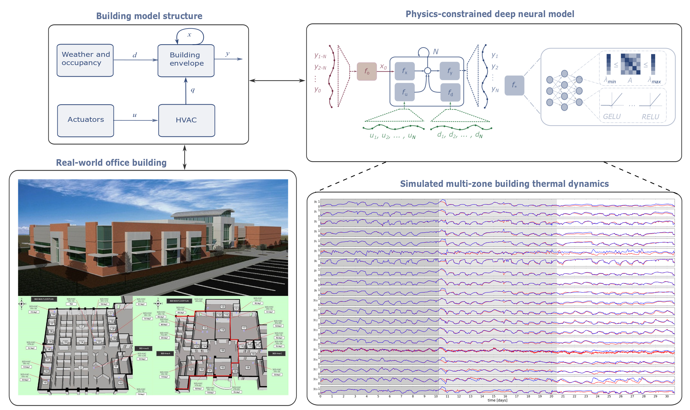
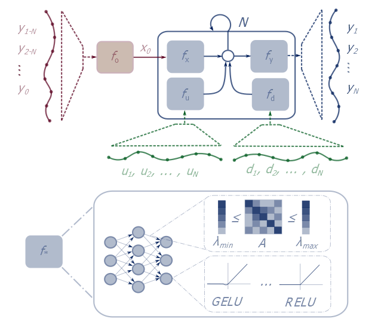
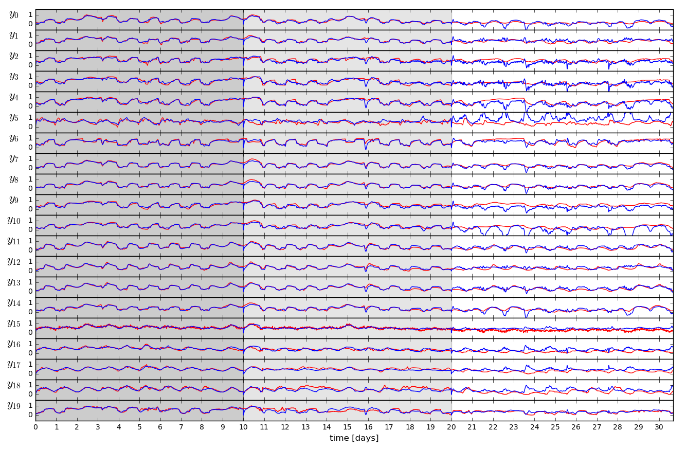

# NeuroMANCER
## Neural Modules with Adaptive Nonlinear Constraints and 	Efficient Regularizations


## Setup

##### Clone and install neuromancer, linear maps, and emulator packages
```console
user@machine:~$ mkdir ecosystem; cd ecosystem
user@machine:~$ git clone https://github.com/pnnl/neuromancer
user@machine:~$ git clone https://github.com/pnnl/psl
user@machine:~$ git clone https://github.com/pnnl/slim

# Resulting file structure:
    ecosystem/
        neuromancer/
        psl/
        slim/
```

##### Create the environment via .yml (Linux)

```console
user@machine:~$ conda env create -f env.yml
(neuromancer) user@machine:~$ source activate neuromancer
```

##### If .yml env creation fails create the environment manually

```console
user@machine:~$ conda config --add channels conda-forge pytorch
user@machine:~$ conda create -n neuromancer python=3.7
user@machine:~$ source activate neuromancer
(neuromancer) user@machine:~$ conda install pytorch torchvision -c pytorch
(neuromancer) user@machine:~$ conda install scipy pandas matplotlib control pyts numba scikit-learn mlflow dill
(neuromancer) user@machine:~$ conda install -c powerai gym
```

##### install neuromancer ecosystem 

```console
(neuromancer) user@machine:~$ cd psl
(neuromancer) user@machine:~$ python setup.py develop
(neuromancer) user@machine:~$ cd ../slim
(neuromancer) user@machine:~$ python setup.py develop
(neuromancer) user@machine:~$ cd ../neuromancer
(neuromancer) user@machine:~$ python setup.py develop
```


###  Learning Constrained Neural State Space Models of Building Thermal Dynamics
Building modeling experiments using differentiable parametric oprimization of Neuromancer.

Implementation of the methods and results presented in the Energy and Buildings paper: [Physics-constrained deep learning of multi-zone building thermal dynamics](https://www.sciencedirect.com/science/article/pii/S0378778821002760).

For a compact overview of the method and results see the [blog post](https://pnnl.github.io/Deep-Learning-Control-with-Embedded-Physical-Structure/eed-building/).



*Conceptual methodology.*


*Architecture of the physics-inspired neural state space model.*


#### Paper results

Comparison of classical linear and proposed neural state space models.


*Best performing linear state space model obtained with subspace idenficiation method.*


*Best performing neural state space model obtained with Neuromancer.*


#### Run experiments

Run system identification with neural state space models:
[neural_system_id](neuromancer/system_ID_building/system_id_building_constraints.py)  

Plot best pefrorming neural model from the saved dataset and run benchmark linear system identification:
[linear_system_id](neuromancer/system_ID_building/nmpc2020_buildings/analysis/sys_ID_eed_building_plots_paper.py)

Plot comparison results from the paper:
[results_analysis](neuromancer/system_ID_building/nmpc2020_buildings/analysis/results_analysis_eed.py)


#### Cite as

@article{DRGONA2021,
title = {Physics-constrained deep learning of multi-zone building thermal dynamics},
journal = {Energy and Buildings},
volume = {243},
pages = {110992},
year = {2021},
issn = {0378-7788},
doi = {https://doi.org/10.1016/j.enbuild.2021.110992},
url = {https://www.sciencedirect.com/science/article/pii/S0378778821002760},
author = {Ján Drgoňa and Aaron R. Tuor and Vikas Chandan and Draguna L. Vrabie},
keywords = {System identification, Physics-constrained deep learning, 
Building thermal dynamics, Control-oriented modeling},
}